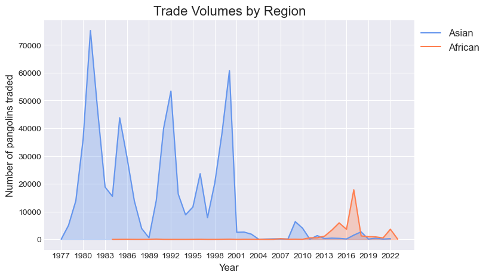
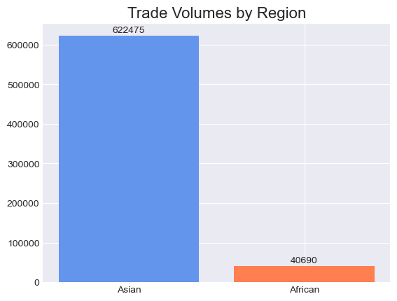
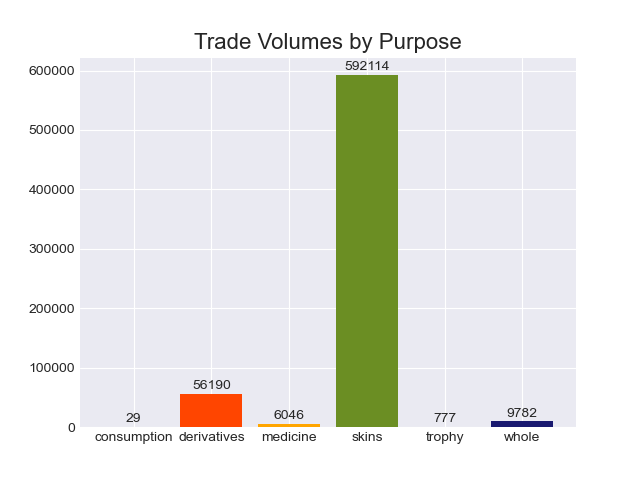
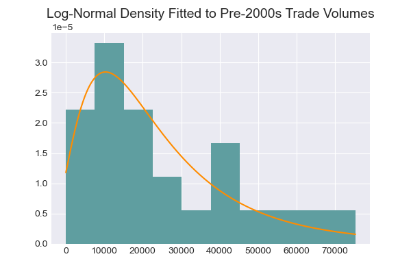
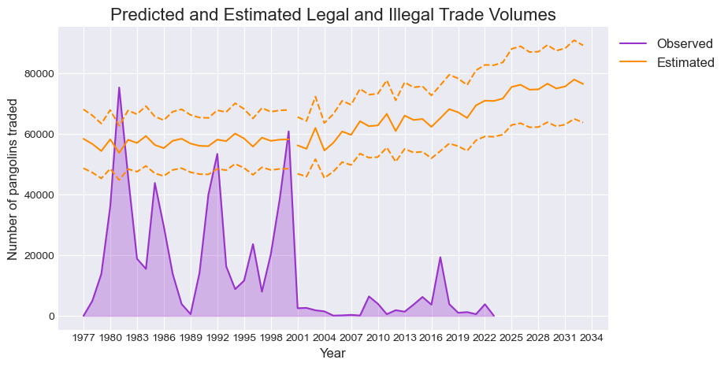

# **PANGOLINS IN PERIL**

# Monte Carlo Predictions of Legal and Illegal Trade in Pangolin Products

## Contents

1. [Project Overview](#project-overview)
2. [Installation and Prerequisites](#installation-and-prerequisites)
3. [Dataset Overview and Preprocessing](#dataset-overview-and-preprocessing)
4. [Exploratory Data Analysis](#exploratory-data-analysis)
5. [Monte Carlo Simulation](#monte-carlo-simulation)
6. [Limitations](#limitations)
7. [Future Work](#future-work)
8. [References](#references)

## Project Overview

#### Aims

The pangolin is a scaly mammal native to parts of Africa and Asia, and is at great risk of extinction due to human trading in pangolin products. The aim of this project is to analyse existing data on recorded trades of pangolin products, identify trends, and use these to predict future trade levels, while taking into account unreported trade and growth in demand.

#### Documents

- **Data Preprocessing.ipynb**: Jupyter notebook containing the procedure to clean the original data set `CITES31May.csv`.  The cleaned data set `CITES.csv` is produced.
- **Exploratory Data Analysis.ipynb**: Jupyter notebook containing a detailed examination of the cleaned data `CITES.csv` and discussion of trends in pangolin trade.  The data set `total.csv` is produced. 
- **Simulation and Forecasting.ipynb**: Jupyter notebook containing the implementation of a Monte Carlo simulation of pangolin trade levels, based on the `total.csv` data. 
- **Datasets**: Folder containing the three data sets (`CITES31May.csv`, `CITES.csv`, `total.csv`) to be used in the Jupyter notebooks.
- **Images**: Folder containing relevant images produced throughout the assignment.
- **Appendix A - Country Codes.pdf**: Document containing country codes used in the original data set `CITES31May.csv` and their classification according to region.
- **Appendix B - Term Classification and Conversion Rates.pdf**: Document containing a detailed breakdown of conversions from quantity of item sold to number of pangolins required for the trade. 

#### Structure

Begin with 'Data Preprocessing.ipynb', being sure to read through 'Appendix A - Country Codes.pdf' and 'Appendix B - Term Classification and Conversion Rates.pdf' for more detailed justifications.  Move then to 'Exploratory Data Analysis.ipynb' for an in-depth analysis of past trends in recorded pangolin trading.  Finally, move to 'Simulation and Forecasting.ipynb' to fit a probability distribution to the data and use Monte Carlo simulation to predict past and future trade levels. 

## Installation and Prerequisites

#### Software Requirements

The following software will be required:

- `python: v3.11+`
- Jupyter Notebook

#### Installation

Clone the repository.  Install the required libraries by running the following line of code:

`pip install pandas numpy matplotlib seaborn statsmodels scipy`

## Dataset Overview and Preprocessing

#### Source of Data

The Convention on International Trade in Endangered Species of Wild Fauna and Flora (CITES) provides a database with all recorded international transactions of wild animal and plant products since 1977.  Our initial dataset `CITES31May.csv` was downloaded from this site on 31 May 2024 and filtered for all trades concerning pangolin related products.

#### Preprocessing

In the file `Data Preprocessing.ipynb` extensive proprocessing of the raw data `CITES31May.csv` is performed.  This includes the removal of extraneous variables and double-counted transactions, addition of indicator variables regarding the origin of the pangolin and purpose of the trade, and conversion of all types of pangolin products to the estimated number of pangolins consumed.  See 'Appendix A - Country Codes.pdf' and 'Appendix B - Term Classification and Conversion Rates.pdf' for full details on conversions.

## Exploratory Data Analysis

'Exploratory Data Analysis.ipynb' analyses the cleaned dataset `CITES.csv`.  Trends are examined according to the origin of the pangolins and the purpose of the trade.  The dataset `total.csv` is produced, containing a summarised version of the trades by year. 

It is clear that Asian pangolin species constitute the bulk of pangolins traded.  However, there is a notable increase in African pangolins traded in recent years.  There is also a clear drop in Asian pangolins traded after 2000, likely caused by the institution of zero-export quotas on wild-caught Asian pangolins (IUCN SSC Pangolin Specialist Group, 2016). 

Skins and related skin products account for almost all of the pangolins traded.  Derivatives also have a significant effect, while the rest of the purposes contribute little.

## Monte Carlo Simulation

Distinction is made between pangolin trading levels before the institution of zero-export quotas for wild-caught Asian pangolins in 2000 and after.  The data is tested for independence and multiple probability distributions are fit to the data.  The optimal distribution is selected using quantile-quantile plots, the Kolmogorov-Smirnov test, and the BIC score. 

A log-normal density provides the best fit to the data.  Monte Carlo simulation is then used to sample from the chosen distribution and generate predictions, taking into account growth rates.  Finally, levels of unreported trade are incorporated into the predictions.

The plot above shows the final predicted number of pangolins killed for trade each year. Almost 3 million pangolins are estimated to have been killed for human consumption since 1977, with the majority of trade happening illegally.  

## Limitations

- *Limited dataset*: The CITES data set contains incomplete entries or transactions recorded twice (by exporter and importer).  It also focuses only on international trade, meaning that all trade of pangolin products within a country has been omitted. In addition, some exporters provide intentionally vague reports to sidestep animal protection regulations.
- *Rates of unreported trade*: A large amount of trade is occurring illegally or not being reported.  Estimates of illegal activity are therefore taken from police seizures of illegally traded material, however these are limited.
- *Growth rates*: It is difficult to measure the true growth in demand for pangolin products, due to the widespread scale of the problem and the illegality of the trade.

Due to these factors the data may provide a skewed view of the true trading activity.  Several assumptions have had to be made, adding more uncertainty to the results. 

## Future Work

- Laws and regulations, their enforcement, and trends in demand are always changing.  A similar analysis done with future data would need to take these updated assumptions into account.  
- This current analysis could be used to inform policymakers and wildlife protection agencies of the threats facing pangolins. 
- The future of the pangolin species is greatly at risk, and there is much to be done to protect them.  If you feel at all inspired by their plight, please visit https://donations.zsl.org/pangolin/ or https://gifts.worldwildlife.org/gift-center/gifts/Species-Adoptions/Pangolin.aspx to donate towards their conservation. 

## References

1. CITES Secretariat and UNEP-WCMC (2022). A guide to using the CITES Trade Database. Version 9. Geneva, Switzerland, and Cambridge, UK. https://trade.cites.org/cites_trade_guidelines/en-CITES_Trade_Database_Guide.pdf 
2. Conciatore, J. (2019, October 15). Up to 2.7 million pangolins are poached every year for scales and meat. Retrieved from African Wildlife 
Foundation: https://www.awf.org/blog/27-million-pangolins-are-poached-every-year-scales-and-meat
3. Convention on International Trade in Endangered Species of Wild Fauna and Flora. (2024, May 31). https://trade.cites.org/
4. David Shepherd Wildlife Foundation. (2024, July 5). Pangolin Facts. Retrieved from David Shepherd Wildlife Foundation: 
https://davidshepherd.org/species/pangolins/facts/
5. Environmental Investigation Agency. (2024). Saving Pangolins from Extinction. Retrieved from Environmental Investigation Agency: https://eia-international.org/wildlife/helping-pangolins/saving-pangolins-from-extinction/
6. Helmsworth, A. (n.d.). Manis culionensis, Philippine pangolin. Retrieved from Animal Diversity Web: 
https://animaldiversity.org/accounts/Manis_culionensis/
7. IUCN SSC Pangolin Specialist Group. (2016, January 11). THE CONSERVATION STATUS, ILLEGAL TRADE AND USE OF PANGOLINS (MANIS SPP.) - Information Document for the 66th Meeting of the CITES Standing Committee. Retrieved from CITES.org: https://cites.org/sites/default/files/eng/com/sc/66/Inf/E-SC66-Inf-23.pdf
8. Kennedy, J. (2023, August 21). Meat Yield from Big Game Animals (With Stats for all Game!). Retrieved from Backfire: https://backfire.tv/meat-yield-from-big-game-animals-with-stats-for-all-game/
9. National Geographic. (n.d.). Pangolins. Retrieved from National Geographic: https://www.nationalgeographic.com/animals/mammals/facts/pangolins
10. Rotich, V. (2018, September 04). Where Do Pangolins Live. Retrieved from WorldAtlas: https://www.worldatlas.com/articles/what-is-a-pangolin.html
11. Stemilt. (2010). Common Pear Carton Specifications. Retrieved from https://www.stemilt.com/assets/pdfs/Cartons_Pears.pd
12. Unknown, “Animal Wildlife,” 16 June 2013. [Online]. Available: https://wildlifeanimalz.blogspot.com/2013/06/Pangolin-Amazing-Animal-Facts.html. [Accessed 31 May 2024].
13. Wildlife Justice Commission. (2020, February). Scaling up: The Rapid Growth in the Industrial Scale Trafficking of Pangolin Scales. Retrieved from Wildlife Justice Commission: https://wildlifejustice.org/wp-content/uploads/2020/02/The_Rapid_Growth_in_the_Trafficking_of_Pangolin_Scales_2015-2019-Update1.pdf
14. WorldData. (2024, July 5). International Country Codes. Retrieved from WorldData: 
https://www.worlddata.info/countrycodes.php 

